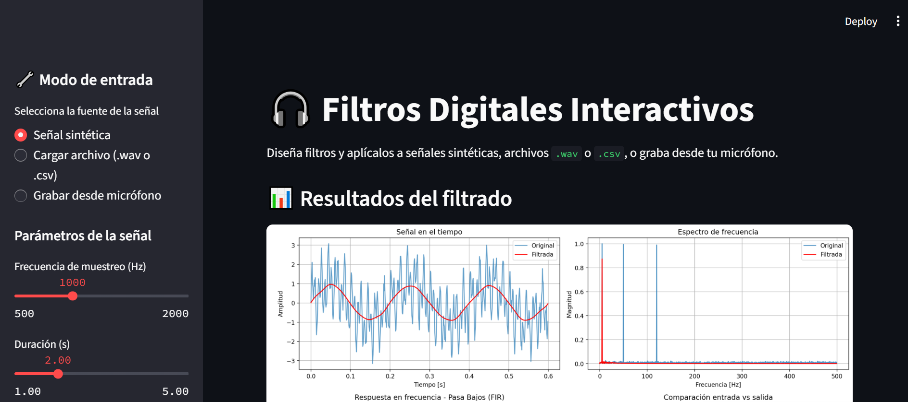

# 🎧 Filtros Digitales Interactivos con Streamlit

Aplicación web interactiva para diseñar y aplicar filtros digitales (pasa bajos, pasa altos, pasa banda) a señales de audio o datos, con soporte para:
- ✅ Señales sintéticas
- ✅ Carga de archivos `.wav` y `.csv`
- ✅ Grabación en tiempo real desde el micrófono
- ✅ Filtrado FIR e IIR
- ✅ Reproducción y descarga del resultado

Ideal para laboratorios, presentaciones académicas o demostraciones en clase de Procesamiento Digital de Señales (DSP).

⚠️ Nota: `sounddevice` requiere `PortAudio`. En Windows, generalmente funciona directamente. En `Linux/macOS`, puede requerir: 

# macOS
brew install portaudio

# Ubuntu/Debian
sudo apt-get install portaudio19-dev python3-pyaudio
---

## 🖼️ Captura de pantalla
  
*(Captura real de la interfaz)*

---

## 🚀 Cómo ejecutar localmente

1. Clona el repositorio:
   ```bash
   git clone https://github.com/tuusuario/filtros-digitales-streamlit.git
   cd filtros-digitales-streamlit

2. Instala las dependencias:
    pip install -r requirements.txt

3. Ejecuta la app:
   streamlit run app.py
   alternativa: python -m streamlit run app.py

4. Abre tu navegador en `http://localhost:8501`
   (Normalmente se abre automaticamente)
---

### ☁️ Despliegue en la nube
Hazlo público con Streamlit Community Cloud :

1. Sube tu código a un repositorio público en GitHub.
2. Inicia sesión en Streamlit Cloud.
3. Conecta tu repositorio.

¡Listo! Tu app estará en línea.


📬 Autor
[Tu Nombre]
[Correo o LinkedIn]